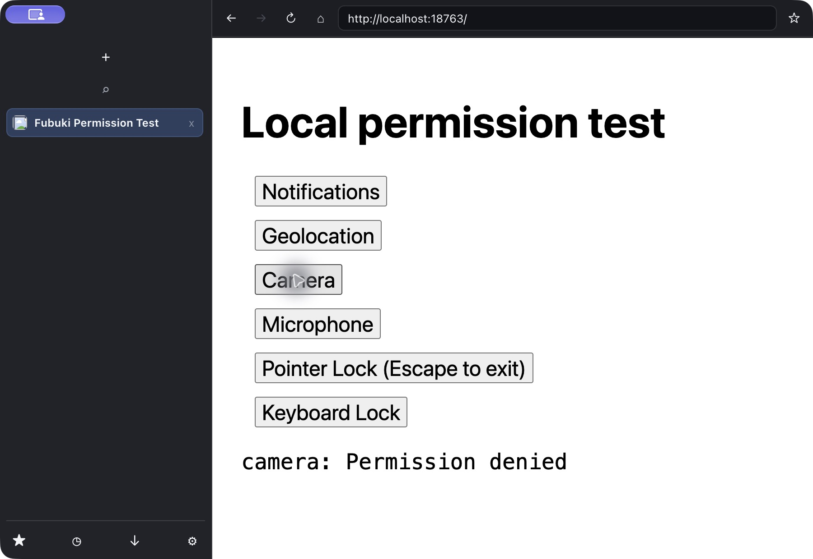

# Permission Broker verification

Tested on macOS Apple Silicon with the locally installed CEF distribution using a fresh `http://localhost:18763` origin.

- Camera and microphone requests display the origin and correct permission in the top-right prompt. Previously the host revealed a top-right rectangle while CSS placed the prompt at the bottom, hiding the controls.
- Camera **Not now** completes with `Permission denied`; requesting again displays another prompt.
- Camera **Block** dismisses the prompt and denies the request.
- Microphone **Allow** dismisses the prompt, but capture still reports `Permission denied`; successful device access is not verified.
- Notifications return `denied` without a prompt. Pointer Lock reports a Chromium error. Geolocation and Keyboard Lock remain to be verified; this issue is still open.
- Automated tests cover all supported CEF permission masks, unknown masks, device-only media capture, callback reentry, cancellation, recycled prompt IDs with stale timers, origin/type-scoped SQLite persistence after reopening, duplicate responses, and late answers after dismissal/window close. Existing private-window tests cover non-persistence.

